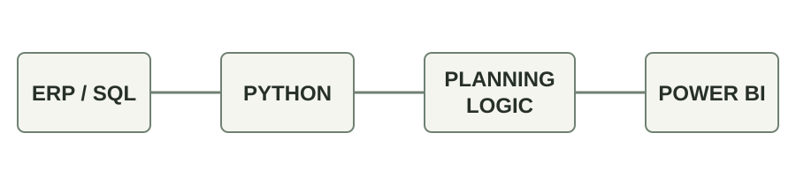

# MRP System
**2026 · Bibliotheca**

At the request of the CPO, I designed, built and implemented a Materials Requirement Planning system using **ODBC / SQL**, **Python** and **Power BI**.

The system was designed as a hands-off pipeline. It processed:
- sales orders and pipeline data
- current and future inventory positions
- calculated goods in / goods out
- multi-level BoM explosion
- allocation rules
- fulfilment and stock-out risk
- advised order quantities and timings
- live non-compliance detection and alerts

The initial build took approximately one month, followed by three months of tuning with the procurement team and CPO. It then entered production and became part of the ongoing S&OP cycle.

